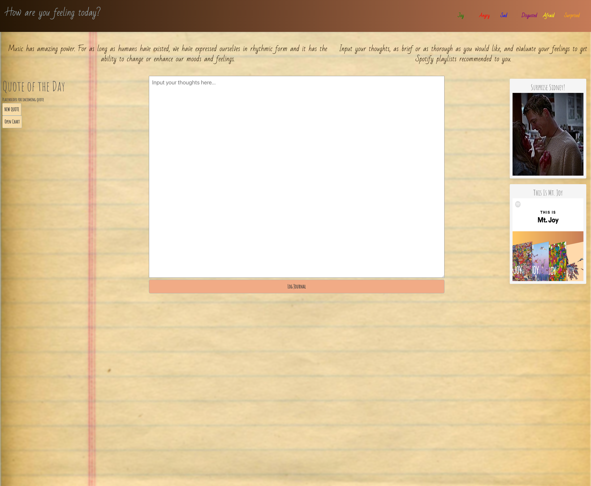

# Journal Playlist


## Collaborators
<a href="https://github.com/richardjhong/journal-playlist/graphs/contributors">
  
</a>

Made with [contrib.rocks](https://contrib.rocks).

## Description
User is able to type into the journal and fetch playlists appropriately from the perceived strongest emotion of the text content.

## Technologies
This project uses [Bulma](https://bulma.io/) for the frontend framework. It also uses three APIs from RapidAPI hub: the [Emotion Analysis API](https://rapidapi.com/twinword/api/emotion-analysis/), the [Famous Quotes API](https://rapidapi.com/saicoder/api/famous-quotes4/), and [Spotify API](https://rapidapi.com/Glavier/api/spotify23/) throughout the app. Lastly [Chart.js](https://www.chartjs.org/) is used for the doughnut chart to give a visual representation of the emotion score tally throughout the day.

## Architecture

At a high level, the user types into the journal text and Emotion Analysis API analyzes the text. After giving a range of scores amongst six different emotions (joy, anger, sadness, disgust, fear, surprise), the highest scoring emotion i.e. the strongest emotion is extracted as a keyword. It is also stored within localStorage which keeps tally of each respective emotions count throughout the day. This same keyword is then put into the Spotify API and 5 playlists are fetched based on appropriate matching; a randomized choice is then stored into the localStorage and then added to the playlist timeline. 

A doughnut chart is created either if there is an existing localStorage collection of emotions of the same day on first load or created upon grabbing the first emotion of the day. This doughnut chart updates as more scores are sttored within localStorage as well. To see the doughnut chart, the user will see a button to see the chart (with at least one emotion score stored in localStorage; otherwise the button will remain hidden).

Upon clicking the quotes button, the Famous Quotes API retrieves 10 quotes. One randomly picked quote displays and it's removed from the pool selection of remaining quotes. Every 30 seconds another randomly picked quote displays and it's then removed from the pool selection of remaining quotes. After 5 minutes (10 quotes that are displayed 30 seconds each is equal to 5 minutes), the Famous Quotes API grabs another 10 quotes and the process of randomizing, etc. repeats.

For more detailed information about the API data retrieval/handling:

- grabEmotions
- grabStrongestEmotion
- grabPlaylists
- injectPlaylistContainer
- grabInspirationalQuote
- injectNewQuote
- injectQuoteContainer

### grabEmotions
grabEmotions uses the textInput from the journal entry and returns a response of the emotion score range associated with the text. A sample response would be similar to:

```
emotion_scores: {
  joy:0.13447999002654
  sadness:0.022660050917593
  surprise:0.0087308825457527
  fear:0
  anger:0
  disgust:0
}
``` 

### grabStrongestEmotion
grabStrongestEmotion depends on the return data of grabEmotions, hence it is wrapped in async itself and await is used with invoking the grabEmotions function within. From here, the highest score value is recorded and the emotion key related is stored within localStorage in the emotionCollection object. The tally of cumulative score to respective emotions are also tracked wtihin localStorage. This also invokes updateChart. Next there is a check to see if the 'chart-modal-button' is visible; if not, then make the button visible. Lastly, the strongestEmotion is returned.

### grabPlaylists
Similar to grabStrongestEmotion, grabPlaylists' fetch call is dependent on waiting for return data from another function; in this case strongestEmotion from grabStrongestEmotion needs to be returned within the async/await. After this is done, an object is returned with playlists.

### injectPlaylistContainer
Once the return from the await grabPlaylists is stored within playlists, a single playlist is randomly chosen for the next playlist to add to the timeline. At the time of pressing the 'Log Journal' button, a skeleton animation card is loaded into the timeline to visually let the user know that while the playlist retrieval is not ready at the time, there is one incoming. By the time injectPlaylistContainer is called the data is ready to loaded into that same card. As such, the skeleton card changes and takes the attributes of a playlistCard. Next the newly created playlistCard information is either prepended into an existing collection arr (localStorage object named playlistTime) or initiated as the first entry within an array. The collection is then stored into localStorage.

### grabInspirationalQuote
This function returns an array with 10 quotes.

### injectNewQuote
This function takes in argument quotes from injectQuoteContainer. With the data (10 quotes all in an array), one is randomly selected and displayed to the page. The quote is then removed from the quotes array. Every 30 seconds, another randomly chosen quote from quotes array is displayed and extracted from the quotes array. When there are no more quotes, this function exits.

### injectQuoteContainer
This function invokes grabInspirationalQuotes, passes the return quotes array into and invokes injectNewQuotes. Lastly a setTimeout calls injectQuoteContainer to repeat the process every 5 minutes (after 10 quotes have been displayed every 30 seconds).

## Sources
For the skeleton loading animation when a playlist is being fetched, heavy inspiration was taken from this [link](https://javascript.plainenglish.io/adding-skeleton-loading-animation-with-css-e6833f6e1d0a).

For snackbar implementation, the [example](https://www.w3schools.com/howto/howto_js_snackbar.asp) within the w3 link was used as a template.

## Screenshot


## Livesite
[Deployed on Github page](https://richardjhong.github.io/journal-playlist/)
